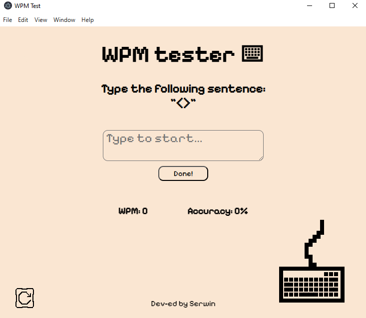

# ⌨️ WPM Tracker

A simple, fun, and retro-styled **Words Per Minute (WPM) Tracker** built with **Electron.js**.  
Test your typing speed and accuracy with quirky, developer-themed sentences.  

---

## 🚀 Features
- Random developer-style sentences for typing tests 🖊️  
- Calculates **WPM (Words per Minute)** in real time ⏱️  
- Tracks **Accuracy** (%) so you know how close you were 📊  
- Auto-resizing input box for smooth typing experience 📜  
- Restart button to quickly start a new test 🔄  
- Pixel-inspired retro design 🎮  

---

## 📸 Screenshot



---

## 📦 Tech Stack
- **Electron.js** → app wrapper.

- **HTML + CSS** → structure & design.

- **JavaScript** → logic (WPM/accuracy calculation, sentence selection).

--- 

## 🛠️ Installation

1. Clone this repo:
   ```bash
   git clone https://github.com/your-username/wpm-tracker.git
   cd wpm-tracker

2. Install dependencies:
    ```bash
    npm install

3. Start the app:
    ```bash
    npm start

---

## 🤝 Contributing

Contributions are welcome! Feel free to fork, open issues, and submit PRs.

---

## 📜 License

This project is licensed under the MIT License.

---

## 👨‍💻 Developer

Dev-ed with ❤️ by Serwin

---
